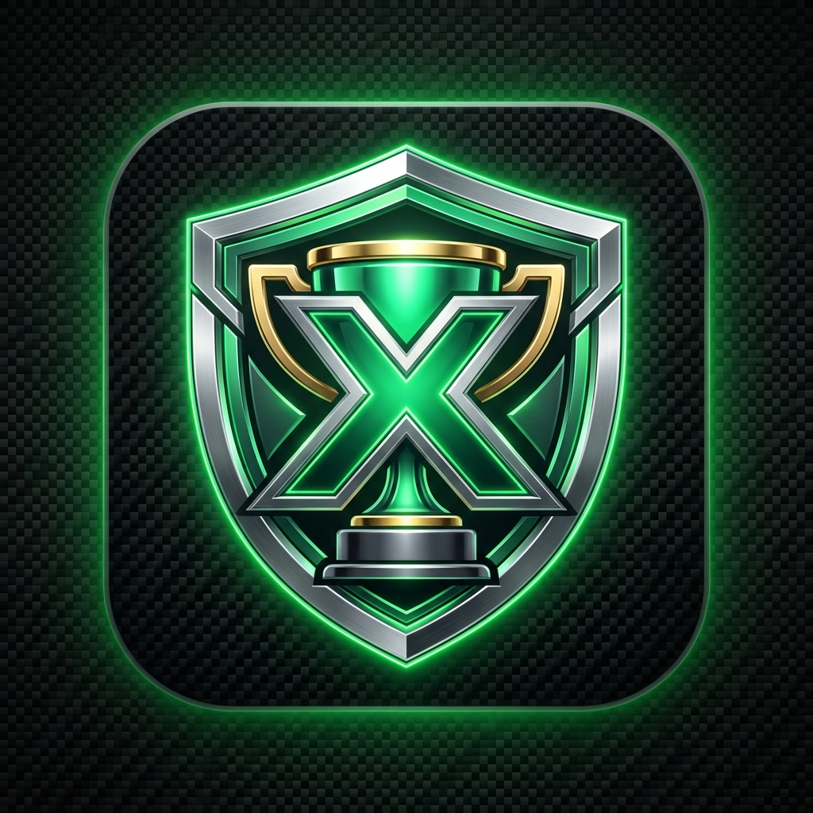

# AchievementForge

**The Next-Generation Xbox Achievement, Telemetry & Presence Engineering Suite for Windows.**

---

## 🌟 Overview

**AchievementForge** is a modern, standalone desktop application built with **.NET 9** and **WPF-UI (Fluent 2)**. It provides a comprehensive command center for Xbox gamers, achievement collectors, and developers to manage achievements, inspect telemetry sessions, spoof presence, and automate workflows via local REST APIs.

---

## ✨ Key Features

### 🎮 Glassmorphism Hero Hub
- **Live Gamer Profile**: Real-time display of GamerPic, Gamertag, XUID, Gamerscore, Tier, Tenure, and Reputation.
- **Diagnostics Dashboard**: Instant visual status of token validity, Xbox background processes, and active presence state.

### 🏆 Interactive Game & Achievement Library
- **Visual Poster Cards**: High-DPI game library with completion percentage progress rings, total Gamerscore, and unlock ratios.
- **High-Performance DataGrid**: Fluid pixel-level scrolling, multi-column sorting, real-time search, and status filters (Locked / Unlocked / Secret).
- **Single-Click & Batch Unlocking**: Unlock individual achievements or entire title catalogs with rate-limiting and custom unlock timestamps.

### 🛰️ Telemetry & Presence Lab
- **Game Presence Spoofer**: Emulate active play sessions for any Title ID or Gamepass title with customizable session timers.
- **ETW Token & Event Sniffer**: Capture and inspect Xbox telemetry events and session tokens in real-time.
- **Gamertag & Stat Showcase**: Inspect public achievements and stats for any Gamertag or XUID.

### ⚡ Developer REST API & Web Dashboard
- Embedded HTTP API server allowing automation and integration from external scripts, web interfaces, and local tools.

---

## 🚀 Getting Started

### Prerequisites
- [Windows 10 / 11 (64-bit)](https://www.microsoft.com/windows)
- [.NET 9 Desktop Runtime](https://dotnet.microsoft.com/download/dotnet/9.0)
- [Xbox App for Windows](https://apps.microsoft.com/store/detail/xbox/9MV0B5HZVK9Z) (Logged in with your Xbox account)

### Installation
1. Download the latest release package (`AchievementForge-v0.1.0-win-x64.zip` or standalone `AF.exe`) from the [Releases](https://github.com/dad8bit/Xbox-Achievement-Unlocker/releases) tab.
2. Extract the archive to your preferred directory.
3. Launch **`AF.exe`**.

---

## 🏗️ Architecture & Technology Stack

| Layer | Technologies |
|---|---|
| **Runtime** | .NET 9.0 (C# 12, Windows x64) |
| **UI Framework** | WPF-UI (Fluent 2 Design System, Mica & Acrylic Backdrops) |
| **Architecture** | MVVM Pattern via `CommunityToolkit.Mvvm`, `Microsoft.Extensions.Hosting` (DI Container) |
| **Networking** | `HttpClientFactory` with automatic GZip/Deflate/Brotli decompression |
| **Data & Storage** | Embedded SQLite (`Microsoft.Data.Sqlite`), `Newtonsoft.Json` |

---

## 📄 License & Acknowledgments

This project is licensed under the [MIT License](LICENSE).

Special thanks to the open-source community and contributors:
- **[WPF-UI](https://github.com/lepoco/wpfui)** — Modern Windows 11 Fluent UI controls.
- **[XboxAuthNet](https://github.com/XboxAuthNet)** — Xbox authentication algorithms and token workflows.
